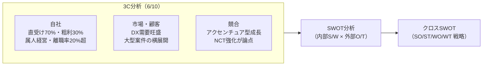
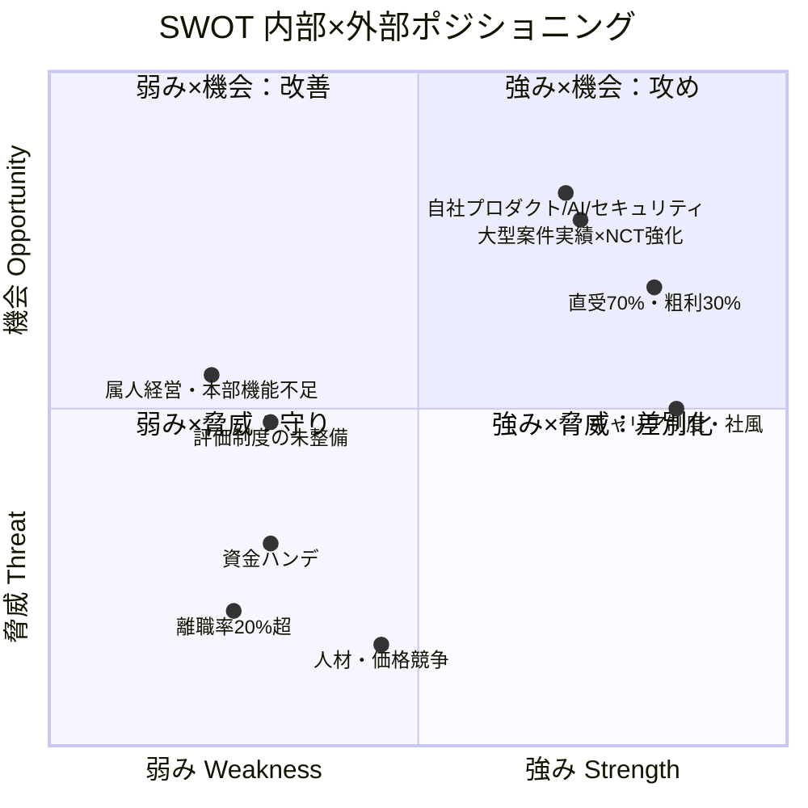
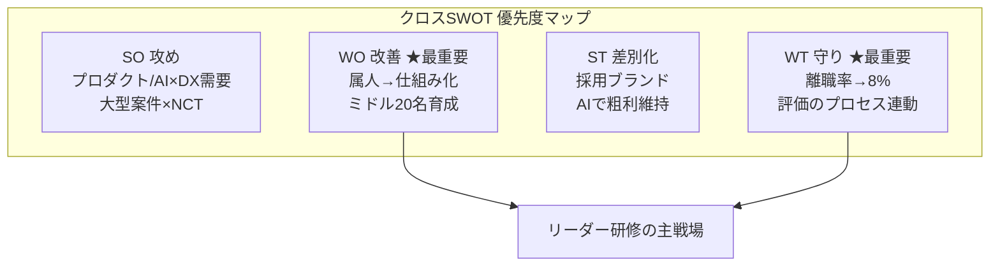

# 現状分析 ― SWOT分析（詳細版）

作成日: 2026-06-15
対象: 日本コムシンク株式会社（R100 / 売上100億円・社員500名 構想）

> 素材：
> - `自社戦略・環境分析.md`（V45⇒R100 / 41〜45期計画）
> - `99-打合せ/議事録/06月10日（水）リーダー研修 打ち合わせ 議事録`（3C分析・自社戦略の把握）
>
> 6/10打ち合わせの決定事項「次回は現状分析（SWOT）を行う」を受けて作成。各項目に**根拠の出所**（戦略資料／議事録）を付与。

---

## 0. 分析の前提（3C → SWOTへの接続）

6/10打ち合わせでは3C分析で課題を深掘りした。その結果をSWOTの入力として整理する。

---

## 1. SWOT要因の洗い出し（詳細）

### 1-1. 強み（Strengths）｜内部・プラス

| # | 強み | 根拠・補足 | 出所 |
|---|------|-----------|------|
| S1 | V40（第二創業期）での変革成功 | 人出し型から脱却し急成長企業へ変貌 | 戦略資料／議事録 |
| S2 | 直受け比率70％・粗利率22→30％ | 中間マージン依存からの脱却が進行 | 戦略資料 |
| S3 | 社内完結のキャリア／スペシャリスト制度 | エンジニアが社内で成長できる道筋 | 戦略資料 |
| S4 | エンジニアキングダム文化・ポジティブ社風 | エンゲージメントの土台 | 戦略資料 |
| S5 | 自社プロダクト保有 | 人月商売以外の収益源の芽 | 議事録 |
| S6 | サプライチェーン系セキュリティ診断 | 成長領域でのサービスメニュー | 議事録 |
| S7 | AI強化の取り組み | DXレバレッジ・差別化要素 | 議事録 |
| S8 | 大規模案件の経験・受注実績 | NCT等、横展開できる実績資産 | 議事録 |

### 1-2. 弱み（Weaknesses）｜内部・マイナス

| # | 弱み | 根拠・補足 | 出所 |
|---|------|-----------|------|
| W1 | 属人的経営（役員が直接把握） | 100億規模では破綻、仕組み化が必須 | 戦略資料 |
| W2 | 高い離職率（40期 約20〜22％） | 採用195〜200名に対し純増49〜50名 | 戦略資料／議事録 |
| W3 | 中堅・リーダー層／本部機能の不足 | ミドルマネジメントの厚みが薄い | 戦略資料／議事録 |
| W4 | 人事考課がプロセス・行動を評価しきれていない | 評価が処遇・循環に結びつかない | 議事録 |
| W5 | 昇給のしづらさ・期待感／公平感の不足 | 優秀層・若手の流出要因 | 議事録 |
| W6 | 若手フォロー・育成体制の弱さ | 入社3年以内の他業種流出、適応障害 | 戦略資料／議事録 |
| W7 | ガバナンス・内部統制が未整備 | IPO準備に向けた体制が途上 | 戦略資料 |
| W8 | 大型案件の横展開が急で社内基盤・余力が不足 | 採用側・社内基盤の受け皿確認が必要 | 議事録 |
| W9 | 稼げる仕組みの社内共有が不十分 | 採用増＝売上増とは限らない構造 | 議事録 |

### 1-3. 機会（Opportunities）｜外部・プラス

| # | 機会 | 根拠・補足 | 出所 |
|---|------|-----------|------|
| O1 | 成長型経済への政策転換 | 賃上げ・投資が牽引、中小を政府が後押し | 戦略資料 |
| O2 | 旺盛なDX需要 | 市場拡大、案件供給は潤沢 | 戦略資料／議事録 |
| O3 | AI・SaaSによるレバレッジ | 労働集約モデルからの脱却手段 | 戦略資料 |
| O4 | M&A・海外展開・IPOの選択肢 | スケール戦略の実行手段 | 戦略資料 |
| O5 | 大型案件の市場（アクセンチュア型成長モデル） | NCT強化で大規模案件を取りにいける | 議事録 |
| O6 | セキュリティ／サプライチェーン領域の需要拡大 | 自社の強みと需要が合致 | 議事録 |

### 1-4. 脅威（Threats）｜外部・マイナス

| # | 脅威 | 根拠・補足 | 出所 |
|---|------|-----------|------|
| T1 | 人材獲得競争 | 中小は採用で構造的に不利 | 戦略資料 |
| T2 | 価格競争 | 人月単価の頭打ち | 戦略資料 |
| T3 | 若年・優秀層の流動性増大 | 年収アップ目的の転職が容易 | 戦略資料／議事録 |
| T4 | メンタルヘルス不全リスク | 適応障害等による離職 | 戦略資料 |
| T5 | 中小ゆえの資金調達ハンデ | 投資・M&A原資の確保が難しい | 戦略資料 |
| T6 | 大型案件における大手競合の存在 | アクセンチュア等とのバッティング | 議事録 |

---

## 2. SWOTマトリクス（俯瞰）

| | プラス要因 | マイナス要因 |
|---|---|---|
| **内部** | **強み(S)** S1 V40変革成功／S2 直受け70%・粗利30%／S3 キャリア制度／S4 ポジティブ社風／S5 自社プロダクト／S6 セキュリティ診断／S7 AI強化／S8 大型案件実績 | **弱み(W)** W1 属人経営／W2 離職率20%超／W3 ミドル・本部不足／W4 評価がプロセス未反映／W5 昇給・公平感不足／W6 若手育成の弱さ／W7 ガバナンス未整備／W8 横展開の基盤不足／W9 稼ぐ仕組みの未共有 |
| **外部** | **機会(O)** O1 成長型経済／O2 DX需要／O3 AI・SaaS／O4 M&A・海外・IPO／O5 大型案件市場／O6 セキュリティ需要 | **脅威(T)** T1 人材獲得競争／T2 価格競争／T3 優秀層流出／T4 メンタル不全／T5 資金ハンデ／T6 大手競合 |

---

## 3. クロスSWOT（TOWS）戦略

SWOTを掛け合わせ、リーダー層が担うべき具体的アクションへ落とし込む。

### SO戦略（強み × 機会）｜攻め＝積極的に伸ばす
- **SO-1**：自社プロダクト・AI・セキュリティ診断（S5/S6/S7）を、旺盛なDX需要（O2/O6）に乗せて**非人月の収益源**へ育てる。
- **SO-2**：大型案件の実績（S8）を武器に、NCT強化でアクセンチュア型の大規模案件市場（O5）を取りにいく。
- **SO-3**：直受け70%・粗利30%（S2）の収益基盤を背景に、M&A・IPO（O4）でスケールを加速。

### ST戦略（強み × 脅威）｜差別化＝強みで脅威をかわす
- **ST-1**：キャリア制度・社風（S3/S4）を採用ブランディングに転化し、人材獲得競争（T1/T3）で優位に立つ。
- **ST-2**：AI・SaaSレバレッジ（S7）で生産性を上げ、価格競争（T2）下でも粗利を維持する。
- **ST-3**：大型案件実績（S8）を差別化要素に、大手競合（T6）とは「直受け・専門領域」で棲み分ける。

### WO戦略（弱み × 機会）｜改善＝機会を捉えるため弱みを克服
- **WO-1**：成長型経済・DX需要（O1/O2）の追い風があるうちに、属人経営（W1）を**仕組み化・制度化**する。
- **WO-2**：M&A・スケール（O4）に耐える**ミドル・本部機能（W3）**を5年で20名育成する（＝リーダー研修の存在意義）。
- **WO-3**：横展開の基盤不足（W8）を、ERP・社内DX（O3）で受け皿として整備する。

### WT戦略（弱み × 脅威）｜守り＝最悪シナリオを回避
- **WT-1**：離職率20%超（W2）×優秀層流出・メンタル不全（T3/T4）＝**最大の内部リスク**。若手フォロー・1on1・公平な評価（W4/W5/W6対策）で**入社3年以内離職10%未満**を死守。
- **WT-2**：稼ぐ仕組みの未共有（W9）×価格競争（T2）に対し、評価をプロセス・行動に連動させ（W4）「稼げる行動」を全社で再現可能にする。
- **WT-3**：資金ハンデ（T5）×ガバナンス未整備（W7）に対し、IPO準備で内部統制を先行整備し資金調達力を高める。

---

## 4. 重点課題（6/10 未決事項との対応）

6/10打ち合わせの未決事項を、本SWOTで優先度付けする。

| 未決事項（6/10） | 関連SWOT | 戦略上の位置づけ | 優先度 |
|---|---|---|---|
| どの課題を優先解決するか | W1/W2/W3 | WO・WT＝仕組み化と離職対策が本丸 | ★★★ |
| 行動・プロセスを評価へどう反映するか | W4/W5 | WT-2＝稼ぐ行動の制度化 | ★★★ |
| 若手の離職防止・育成体制の強化 | W2/W6/T3/T4 | WT-1＝最大の内部リスク回避 | ★★★ |
| 採用増だけでなく稼ぐ仕組みの社内共有 | W8/W9 | WO-3／WT-2 | ★★ |
| NCT強化・大規模案件をどう位置づけるか | S8/O5/T6 | SO-2＝攻めの主軸 | ★★ |

---

## 5. リーダーへの示唆（まとめ）

- SWOTの結論は明快：**攻め（SO）の伸びしろは大きいが、守り（WT）と改善（WO）を固めないとスケールに耐えられない**。
- リーダー研修が直接効く領域は **WO（属人→仕組み化・ミドル育成）** と **WT（離職率低減・評価のプロセス連動）**。ここがミドルマネジメントの主戦場。
- 最大の内部リスクは依然 **離職（W2×T3/T4）**。採用拡大と同時に「カルチャーフィット重視・入社3年以内離職10%未満」を現場で実行することがリーダーの責務。

---

## 6. 次回（6/17）に向けた事前質問事項（たたき台）

1. 優先解決すべき課題は「離職率低減」「仕組み化」「評価制度改革」のどれを最上位に置くか？
2. 行動・プロセス評価は、どの職務（リーダー職務定義）を基準に設計するか？
3. NCT強化・大型案件は、どの期から本格的にリソースを振り向けるか？
4. ミドル20名育成の選抜基準・育成期間・到達基準をどう定義するか？
5. AI・自社プロダクト・セキュリティ診断のうち、非人月収益の主軸はどれか？
