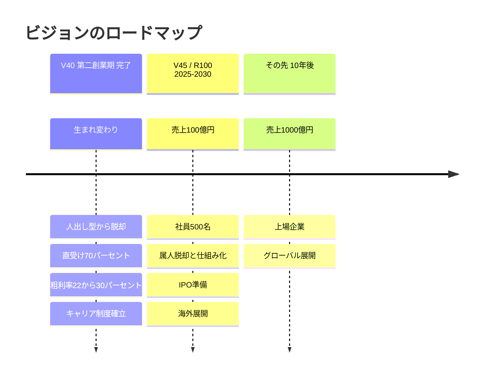
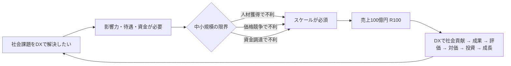
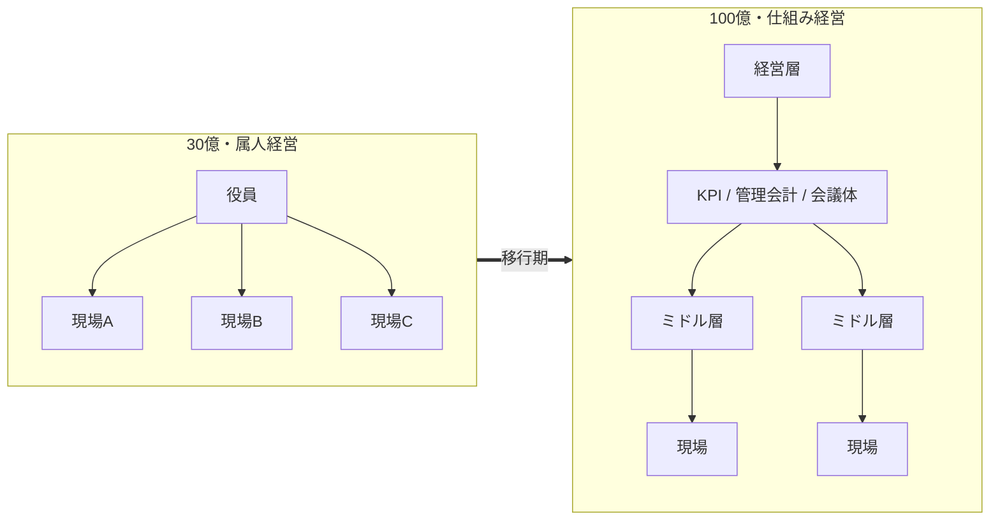
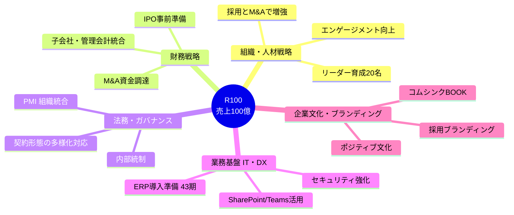
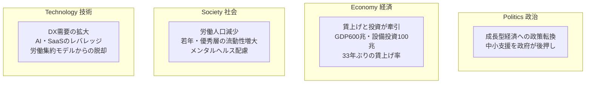
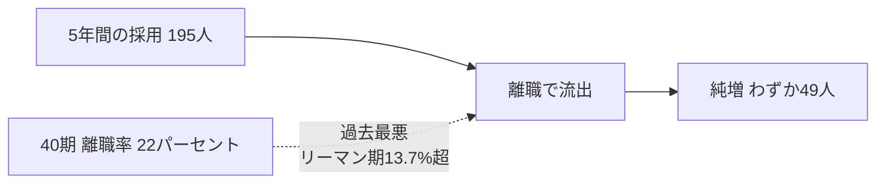
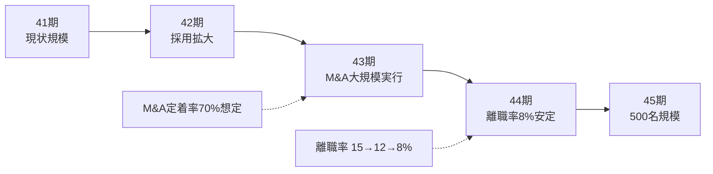
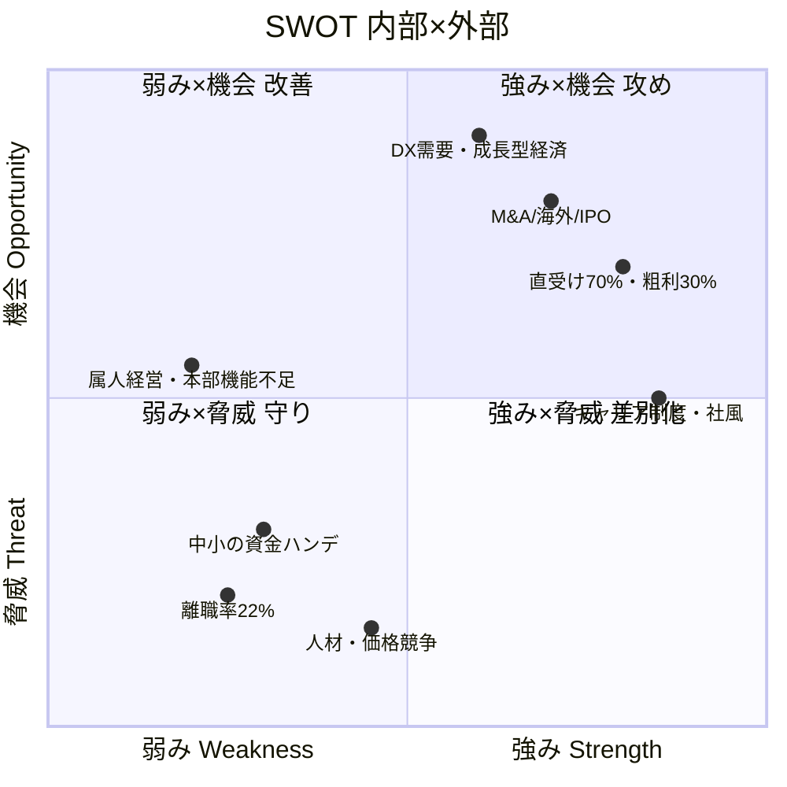
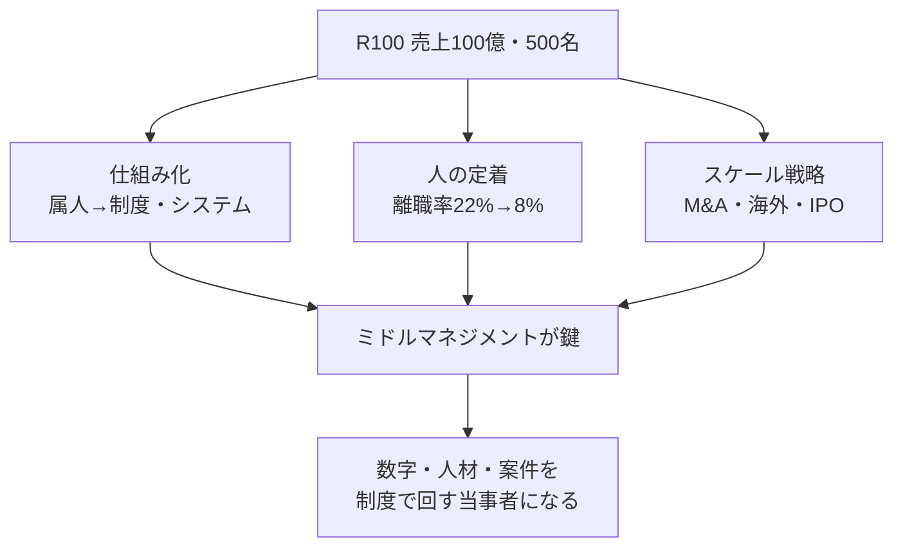

# 自社戦略・環境分析（リーダ研修ワーク）

> 参考資料：`V45（仮）_20250611⇒R100.pptx` / `R100_バリューアップセンター5か年と41期計画 ver6.1.pptx`
> 対象：日本コムシンク株式会社　期間：2025/10〜2030/9（41〜45期）

---

## 1. 自社戦略の把握（30分）

### 1-1. ビジョンの全体像

当社は「企業の寿命30年」の衰退期に入りかけたところを、**V40（第二創業期）**で生まれ変わった。
次は内向き（社員の年収アップ）から外向き（社会課題をDXで解決し永続する）への転換であり、その器づくりが **R100** である。

#### V40で得たもの／本当に欲しかったもの
- **得たもの**：明確な他社優位性、業界内ポジション、社内完結のキャリアビジョン、急成長企業への変貌。
- **本当に欲しかったもの**：①より多くの課題を解決できる「**影響力**」　②社員を物心両面で豊かにする「**待遇と誇り**」　③挑戦への「**資金と信用**」。
- これらを得るための答えが **スケール（規模拡大）** —— 中小の限界（人材・価格競争・資金調達）と労働集約モデルからの脱却。

### 1-2. なぜ100億円なのか（戦略の論理）

> 「DXで社会に貢献 → 成果 → 評価 → 対価 → 投資 → 成長」の好循環を回せる規模が100億円。さらに市場からの資金調達で10年後1,000億円を目指す。

### 1-3. 本質的な課題：経営コントロールの質的転換

売上規模が上がると、経営の「見え方」と「回し方」が根本的に変わる。

| 売上 | 経営の回し方 | キーワード |
|---|---|---|
| 30億 | 役員が案件・トラブル・評価を直接把握 | **属人的でも回る** |
| 100億 | 中間層が制度に基づき「数字・人材・案件」を管理。社長から現場が見えにくくなり、KPI・管理会計・会議体で**間接的に**意思決定 | **制度化・システム化・ミドル育成が必須** |

> **「人がやる仕組み」から「仕組みが人を動かす」への移行** —— 経営コントロールは5〜10倍難しくなる。

### 1-4. R100達成の姿（社員500名＝1,000億円への通過点）

- 社員数 **500名**、**属人性から脱却**し持続的に生産性の高い組織
- 中堅・リーダー層が育ち**マネジメントが機能**、**本部機能が戦略を立て経営を牽引**
- **IPO準備**が進むガバナンス・監査体制（監査法人契約済）、内部監査・ガバナンス機能立ち上げ
- 海外展開に対応（外国籍比率5％・国際契約対応）する多様性ある組織
- 拠点：東京本社（IPO/M&A視野）、大阪はメイン開発拠点、滋賀＋開発1拠点を検討

### 1-5. R100の5つの柱とVUC戦略

**VUC（バリューアップセンター）戦略の5要点**

| # | 施策 | 狙い | ポイント |
|---|---|---|---|
| ① | 採用とM&A | 組織増強 | 41期は核人材にこだわる→42期以降に未経験採用も。M&Aは3年目に大規模実行（定着率70％想定） |
| ② | リーダー・M候補育成 | 組織を支える | 500名時にM層10〜12％＝約50名。**5年で20名**を育成 |
| ③ | 専任人材採用・VUCから独立 | 意思決定スピード向上 | 人事（コーポレート／HRBP）・財務・法務・情シスを機能分化 |
| ④ | エンゲージメント向上 | 組織に活力 | 行動指針＝コムシンクBOOK、東京オフィス1フロア化 |
| ⑤ | システム基盤整備 | 業務効率化 | 300名超でSaaS限界 → 43期にERP導入準備 |

### 1-6. 41期（初年度）の重点施策

- **人事・組織開発**：CHRO候補＋採用担当2名採用。新卒8名・中途30名（核人材にこだわる）。スキル重視→**カルチャーフィット重視**へ。
- **企業文化**：ポジティブ評価制度、オンボーディング充実、コムシンクBOOK策定・浸透。
- **財務**：非常勤CFO採用、銀行連携でM&A資金調達、子会社・管理会計の仕組みづくり。
- **法務・総務**：契約書テンプレ化、M&AのPMI（規程・雇用契約・人事制度の統合）。
- **業務基盤**：社内DX（SharePoint/Teams、楽楽販売）、セキュリティ強化、東京オフィス1フロア化。

---

## 2. 外部環境（マクロ／業界）

### 2-1. PEST分析

- **政治・経済**：コストカット型経済から「**賃上げと投資が牽引する成長型経済**」へ移行期。中小企業が**雇用の7割・付加価値の5割**を担い、政府が全力で後押し。
  → コムシンクは「**成長型を代表する企業**」としてこの政策の波に乗るポジションを取りにいく。
- **社会**：採用しても定着しなければ純増しない。若年・優秀層をいかに惹きつけ留めるかが勝負。
- **技術**：DX需要は旺盛。**人×時間（労働集約）モデル**のままではレバレッジが効かず、AI・SaaSへの投資が必須。

### 2-2. 業界構造と人材市場
- 中小ITは**人材獲得・価格競争・資金調達で構造的に不利** → スケールが生存条件。
- 業界離職率の目安（情報通信業）：999人以下企業 **15〜19％**／全体平均 **12％**。
  → R100計画では 41期15％ → 42期12％ → **44期8％以内**で安定を目標。

---

## 3. 内部環境（自社の現状）

### 3-1. V40の振り返り（採用と離職）

退職理由の分析と打ち手：

| 退職理由 | 傾向 | 打ち手 |
|---|---|---|
| 新卒で職種に迷う層 | 3年以内に他業界へ転職 | 3年目を乗り越える**若年フォロー**（1on1・悩みのキャッチ） |
| 年収アップ目的の転職 | **優秀層**に多い | 育成枠・スキップ昇格で期待感を待遇に変える |
| 営業部解体の影響 | 情報不足による不安 | 社内広報の統一・会議内容の下達 |
| 疾病退職11名中6名が若年の適応障害 | コミュニケーション環境 | コミュニケーションスタイルへの配慮 |

### 3-2. 人員計画（500名シナリオ）

- 新卒・中途に加え、**3年目（43期）にM&Aで一気に規模拡大**。
- 500名時に必要なM層は約50名（現状M16名・AM17名）→ **5年で20名のM層を新規育成／採用**。

### 3-3. SWOT分析

| | プラス要因 | マイナス要因 |
|---|---|---|
| **内部** | **強み(S)**：V40での変革成功・直受け70％・粗利率30％・キャリア／スペシャリスト制度・エンジニアキングダム文化 | **弱み(W)**：属人的経営・高離職率（22％）・中堅／リーダー層と本部機能の不足・ガバナンス未整備・現規模の限界 |
| **外部** | **機会(O)**：成長型経済政策・旺盛なDX需要・M&A／海外展開・IPO・AI/SaaSのレバレッジ | **脅威(T)**：人材獲得＆価格競争・若年／優秀層の流出・メンタル不全・中小ゆえの資金調達ハンデ |

---

## 4. リーダーへの示唆（まとめ）

- R100は「売上拡大」だけでなく、**属人 → 仕組み**への経営インフラ転換が本丸。**リーダー層の育成（5年で20名）**が成否を握る。
- 最大の内部リスクは**離職**。採用拡大と同時に「**カルチャーフィット重視・入社3年以内離職10％未満**」を現場で実行することがリーダーの責務。
- 外部の追い風（成長型経済・DX需要）を活かし、M&A／海外／IPOというスケール戦略を支える**ミドルマネジメント**になることが期待されている。
