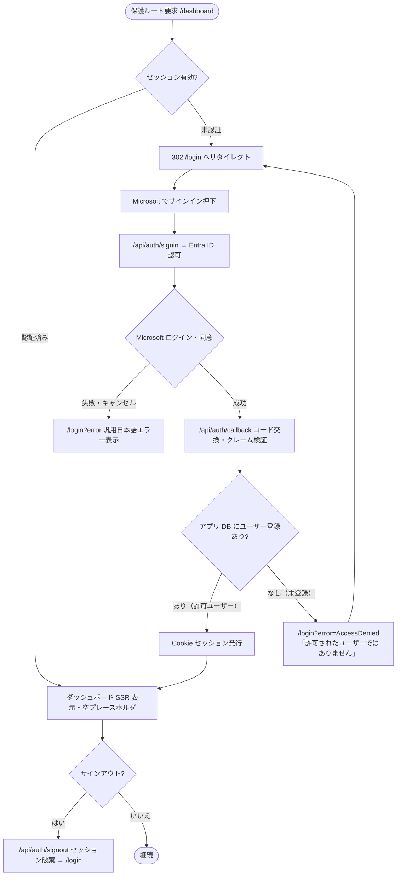
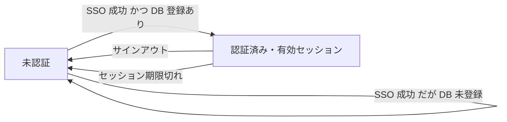

# フロー図 — Issue #31

> **Mermaid 記法の注意**: ノードラベルが `/` で始まると（例 `[/login]`）パーサが平行四辺形シェイプ `[/text/]` の開始と誤認し
> `Lexical error ... Unrecognized text` になる。`/` やスラッシュを含むラベルは **ダブルクォートで囲む**（例 `["/login へ"]`）。

## 保護ルートアクセスの認証・認可判定

SSO（Entra ID）で認証が成立しても、**アプリ DB に登録されたユーザーのみログインを許可**する（許可リスト方式）。
未登録ユーザーはセッションを発行せず、ログイン画面のまま「許可されたユーザーではありません」を表示する。

## セッション状態遷移

## 補足

- SSO 認証の成立後に **アプリ DB（PostgreSQL）でユーザーを照合**し、登録があればログイン可、なければ拒否する（既定拒否 / `authz.md` §5）。照合キーは Entra ID の一意識別子（`oid`）またはメールアドレス。
- 拒否時は **セッション（JWT Cookie）を発行しない**。`/login?error=AccessDenied` へ戻し、ログイン画面のまま「許可されたユーザーではありません」を表示する（文言は `error-message.md` の「ユーザー」表記に統一）。
- 実装方針: Auth.js（NextAuth v5）の `signIn` コールバックで DB 照合し、未登録なら `false` を返してサインインを拒否する（`pages.error: "/login"` により `/login` へ誘導）。照合は `lib/auth/` に集約する。
- 本 Issue の認可は「**認証済み かつ DB 登録済みか否か**」まで。Entra グループ → アプリロール変換は後続 Issue（`authz.md` §3）。
- `/`（トップ）は公開。`/dashboard` を保護対象とする。`/login` は未認証向け（認証済みでアクセスしたら `/dashboard` へ寄せる）。
