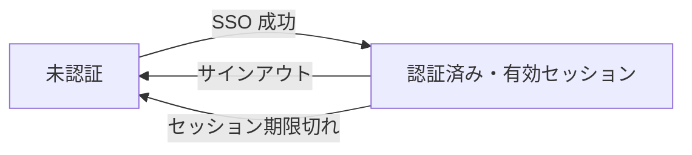

# フロー図 — Issue #31

## 保護ルートアクセスの認証判定

```mermaid
flowchart TD
    Start([保護ルート要求 /dashboard]) --> Auth{Entra ID セッション検証 auth}
    Auth -->|認証済み| Render[ダッシュボード SSR 表示・空プレースホルダ]
    Auth -->|未認証| Login[302 /login へリダイレクト]
    Login --> SignIn{Microsoft でサインイン押下}
    SignIn -->|押下| Redirect[/api/auth/signin → Entra ID 認可]
    Redirect --> MS{Microsoft ログイン・同意}
    MS -->|成功| Callback[/api/auth/callback コード交換]
    MS -->|失敗・キャンセル| LoginErr[/login?error 表示]
    Callback -->|トークン検証 OK| Session[Cookie セッション発行]
    Callback -->|state 不一致・交換失敗| LoginErr
    Session --> Render
    Render --> Out{サインアウト?}
    Out -->|はい| Signout[/api/auth/signout セッション破棄 → /login]
    Out -->|いいえ| Done([継続])
```

## セッション状態遷移



## 補足

- 本 Issue の認可は「認証済みか否か」のみ（Entra グループ → アプリロール変換は後続 Issue / `authz.md` §3）。
- `/`（トップ）は公開。`/dashboard` を保護対象とする。`/login` は未認証向け（認証済みでアクセスしたら `/dashboard` へ寄せる）。
