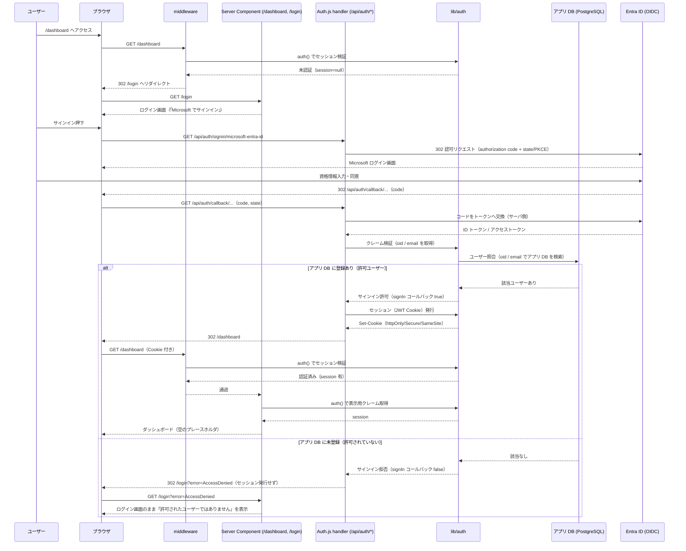
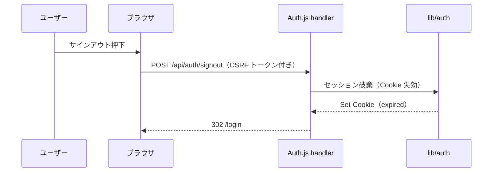

# シーケンス図 — Issue #31（M365 Entra ID SSO ログイン + 空ダッシュボード）

ライブラリ: **Auth.js（NextAuth v5）+ Microsoft Entra ID プロバイダ**。セッションは暗号化 Cookie（JWT 戦略）、検証はサーバ側のみ。

## アクター

- ユーザー（社員）
- ブラウザ
- middleware（`middleware.ts` / 認証ガード）
- Server Component（`app/dashboard/page.tsx` 等）
- Auth.js route handler（`app/api/auth/[...nextauth]/route.ts`）
- lib（`lib/auth/` 認証設定・セッション取得）
- Entra ID（M365 SSO / OIDC 認可サーバ）

## メイン: 未認証 → SSO ログイン → DB 照合 → ダッシュボード表示

SSO 認証が成立しても、**アプリ DB に登録されたユーザーのみログインを許可**する（許可リスト方式）。
未登録ユーザーはセッションを発行せず、ログイン画面のまま「許可されたユーザーではありません」を表示する。

## サインアウト

## エラー経路

- **未認証で保護ルート**: middleware が 302 で `/login` へ（401 ボディは返さず UI 誘導）。
- **SSO 成功だがアプリ DB に未登録（許可外ユーザー）**: `signIn` コールバックでサインインを拒否し、**セッションを発行しない**。`/login?error=AccessDenied` へ戻し、ログイン画面のまま「許可されたユーザーではありません」を表示する。内部理由（どのチェックで弾いたか）は出さず、文言は `error-message.md`（「ユーザー」表記）に統一。拒否の事実はサーバログ / 監査ログに記録する（`logging.md` §4・§5）。
- **コールバック失敗 / state 不一致 / トークン交換失敗**: Auth.js のエラーページ（`/api/auth/error`）または `/login?error=...` へ誘導。文言は技術詳細を出さない（`error-message.md` §3.4）。詳細はサーバログのみ（`logging.md` §5）。
- **設定不備（env 欠落）**: 起動時バリデーションで fail-fast（`config.md` §3）。
- **相関 ID**: 入口で `x-request-id` を発番/踏襲しログに付与（`logging.md` §3.1）。
