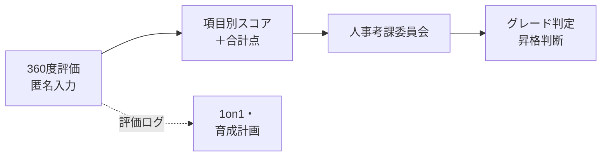
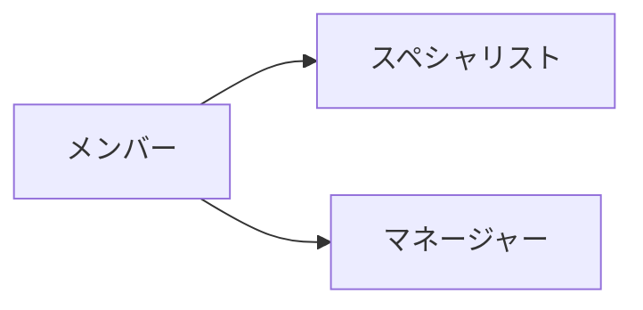
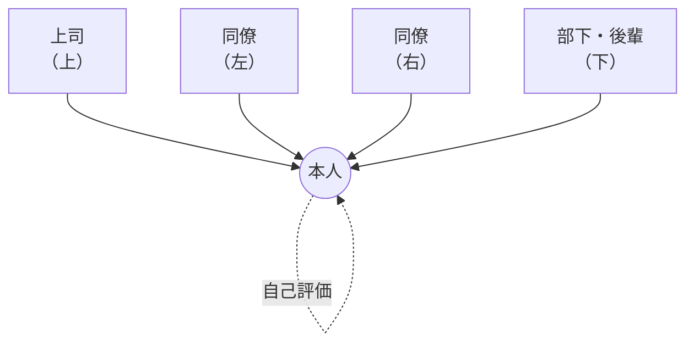
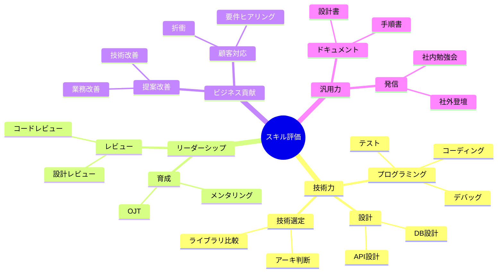
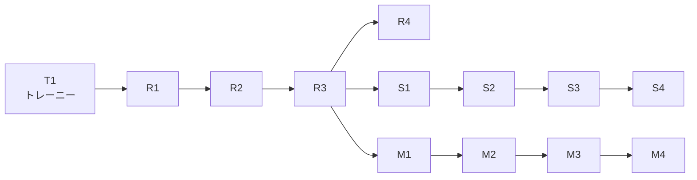
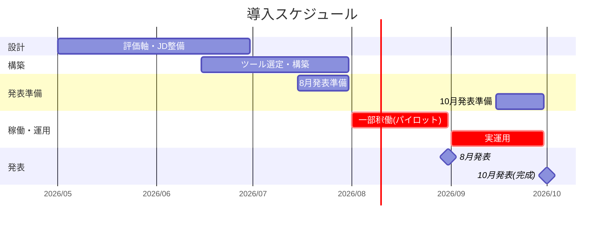

# ジョブ型エンジニア評価制度の構想

## 3点サマリー

- **解決したい課題**：エンジニアの貢献が上長からの評価のみで、評価への納得感が低い／社内のスキル分布もキャリア指針も曖昧。
- **なにをするか**：360度評価ベースのスキル可視化システムを導入し、合計点を人事考課委員会の判定材料に組み込む。
- **なにが助かるか**：本人は強み・弱みが見え、上長はデータで説明でき、会社はスキル検索と評価透明化で離職率を改善できる。

> **一言で**：上長の主観に依存しない、360度評価ベースのスキル可視化システムを2026年10月までに全社稼働させ、人事考課委員会の判定材料として運用する。

## ゴール

**2026年10月までに**、スキル評価システムを全社稼働させ、
360度評価による合計点数を **人事考課委員会の判定基準の一部** として運用する。

---

## 解決したい課題

準委任の常駐エンジニアが多い当社では、上長が日々の業務を見られないため、人事考課（半期/年次）だけでは貢献を測りきれない。
これが評価への納得感を欠き、**モチベーション低下と離職** の温床になっている。

### 1. 頑張っても評価につながらない

- スキルを上げても、上長が常駐現場の働きぶりを見られないので評価に反映されにくい
- 「結局は上長との接点の量で決まる」と感じる人が増えている

### 2. 誰が何を持っているか会社が把握できていない

- スキル情報が現場ごとに散らばっていて、社内検索できる状態にない
- 新規案件のアサイン時に **「あのスキルを持っている人を集めて」** に答えられない

### 3. 次に何を目指せばいいか分からない

- スペシャリストになるのか、マネジメントに進むのか、判断材料が無い
- 上位グレードへの **要件が言語化されていない** ため、目標設定がふわっとする

---

## なにをするか

人事考課を補完する **スキル評価システム** を導入する。
**現場軸（専門性）＋ 汎用軸（他現場でも通用する力）** の2軸で、上長以外も含めた多面評価で見る。

### 全体像

### 1. 3トラック構成

メンバーで基礎を積んだあと、適性に応じて **スペシャリスト** または **マネージャー** に分岐する。

### 2. 360度評価（匿名）

上長だけでなく、同僚・部下・本人からも多面的に評価する。匿名にすることで率直なフィードバックを担保する。

| 視点 | 評価者 | 何を見るか |
|---|---|---|
| 上 | 上司 | 役割遂行・成果 |
| 下 | 部下・後輩 | 育成・サポート姿勢 |
| 左右 | 同僚 | 協働・技術貢献 |
| 中央 | 本人 | 自己認識・成長実感 |

### 3. 評価項目（カテゴリ階層）

カテゴリ → 大項目 → **小項目** の3階層で、得意・不得意がピンポイントで見える。

#### 評価シートのサンプル（5段階）

| カテゴリ | 大項目 | 小項目 | レベル |
|---|---|---|:-:|
| 技術力 | プログラミング | コーディング | ★★★★☆ |
| 技術力 | プログラミング | テスト作成 | ★★★☆☆ |
| 技術力 | 設計 | API設計 | ★★★☆☆ |
| 技術力 | 設計 | DB設計 | ★★☆☆☆ |
| リーダーシップ | レビュー | コードレビュー | ★★★★☆ |
| リーダーシップ | 育成 | OJT・メンタリング | ★★☆☆☆ |
| ビジネス貢献 | 顧客対応 | 要件ヒアリング | ★★★☆☆ |
| 汎用力 | ドキュメント | 設計書作成 | ★★★☆☆ |
| 汎用力 | 発信 | 社内勉強会登壇 | ★☆☆☆☆ |

### 4. グレード体系（既存の T / R / S / M と連動）

**T1（トレーニー）** から始まり、R3 以降で S（スペシャリスト）／M（マネージャー）に分岐する。

### 5. グレード × 評価項目の重み付け

求める力に合わせて、グレードごとに重み係数を変える。

| グレード帯 | 技術力 | リーダーシップ | ビジネス貢献 | 汎用力 |
|---|:-:|:-:|:-:|:-:|
| T1〜R2（基礎期） | ◎ | △ | △ | ○ |
| R3〜R4（メンバー上位） | ◎ | ○ | ○ | ○ |
| S1〜S4（スペシャリスト） | ◎◎ | ○ | ○ | ◎ |
| M1〜M4（マネージャー） | ○ | ◎◎ | ◎ | ◎ |

### 6. スコア算出と判定基準

合計点数は人事考課委員会の **判定材料の "一部"** として使う。点数だけで自動昇格はしない。

#### スコア算出の例（R2メンバー）

| カテゴリ | 大項目 | レベル | 重み | 点数 |
|---|---|:-:|:-:|:-:|
| 技術力 | プログラミング | 4 | ×2 | 8 |
| 技術力 | 設計 | 3 | ×2 | 6 |
| リーダーシップ | コードレビュー | 4 | ×1 | 4 |
| リーダーシップ | 育成 | 2 | ×1 | 2 |
| ビジネス貢献 | 顧客対応 | 3 | ×1 | 3 |
| 汎用力 | ドキュメント | 3 | ×1 | 3 |
| 汎用力 | 発信 | 1 | ×1 | 1 |
| | | | **合計** | **27点** |

#### 判定の目安

| 合計点数 | 想定判定 |
|:-:|---|
| 〜20点 | 現グレード継続。課題項目を1on1で重点フォロー |
| 21〜29点 | 現グレード継続。伸びている領域を強化 |
| **30点以上** | **次グレードへの昇格候補** として委員会で個別審議 |

※ 点数は **判定基準の一部**。最終判断は人事考課委員会が、360度評価のコメント・成果実績・上長所見と併せて総合的に行う。
**数値で機械的に決めず、人の判断を支援するデータ** と位置づける。

---

## なにが助かるか

### エンジニア本人

- 「**頑張っているのに評価されない**」のモヤモヤが、データで裏付けされて解消される
- 自分の **強み・弱み・伸びしろ** が小項目単位で見える → 学習計画が立てやすい
- **キャリアの分岐点**（スペシャリスト vs マネージャー）を判断する材料が手に入る

### 上長・マネージャー

- 常駐で見えない部下のスキル・貢献を **客観データ** で補える
- 1on1の話題が「最近どう？」から「ここのスコアが下がってるけど何かあった？」に具体化
- 昇格を推す／推さないの **説明責任** をデータで果たせる

### 会社・経営層

- 新規案件で「あのスキルを持つ人を3名」が **検索で出る** ようになる
- 評価制度の透明性向上で **離職率を年−1〜2pt** 改善目標
- 人事考課委員会の議論が「印象論」から「データを見ながら」に切り替わり、 **判断スピードが上がる**

### KPI（効果測定）

#### アンケート（半期ごと実施）

| 指標 | 設問例 | 目標 |
|---|---|---|
| 評価納得度 | 自分の評価に納得しているか（5段階） | 4以上が **70%** |
| 制度満足度 | 評価制度全体に満足しているか | 4以上が **60%** |
| 成長実感 | 自分の成長を実感できているか | 4以上が **70%** |

#### 定量指標（システムから自動取得）

| 指標 | 内容 | 目標 |
|---|---|---|
| 評価入力完了率 | 評価サイクルでの入力率 | **90%以上** |
| 離職率（エンジニア職） | 年次離職率の前年比 | **−1〜2pt** |
| 昇格者数 | 評価を根拠とした昇格判定件数 | 運用後に推移を確認 |
| スキルレベルの伸び | 全社平均スキル点数の半期推移 | 上昇トレンド維持 |

---

## スケジュール

**8月：パイロット稼働＋発表 ／ 9月：実運用 ／ 10月：完成発表**

